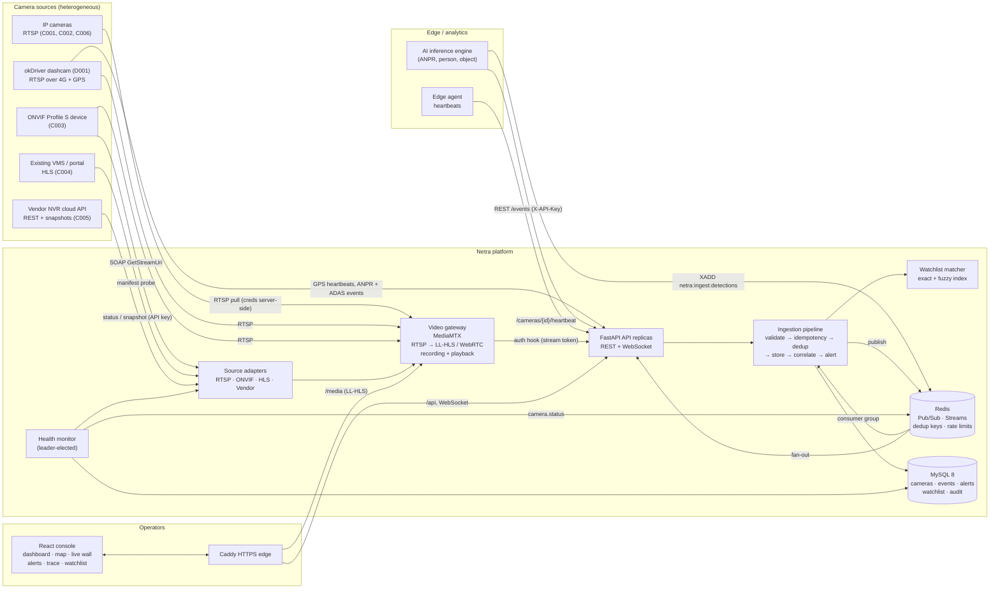
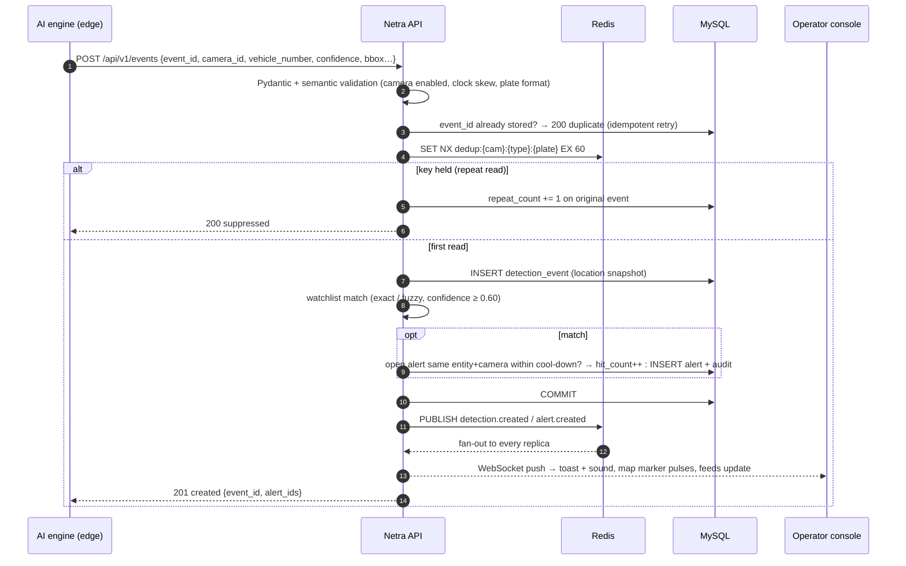
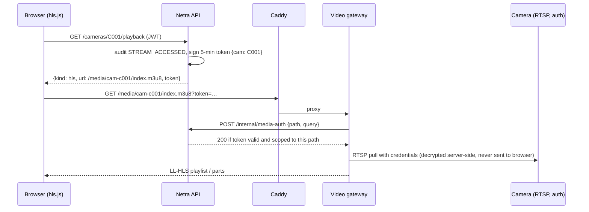
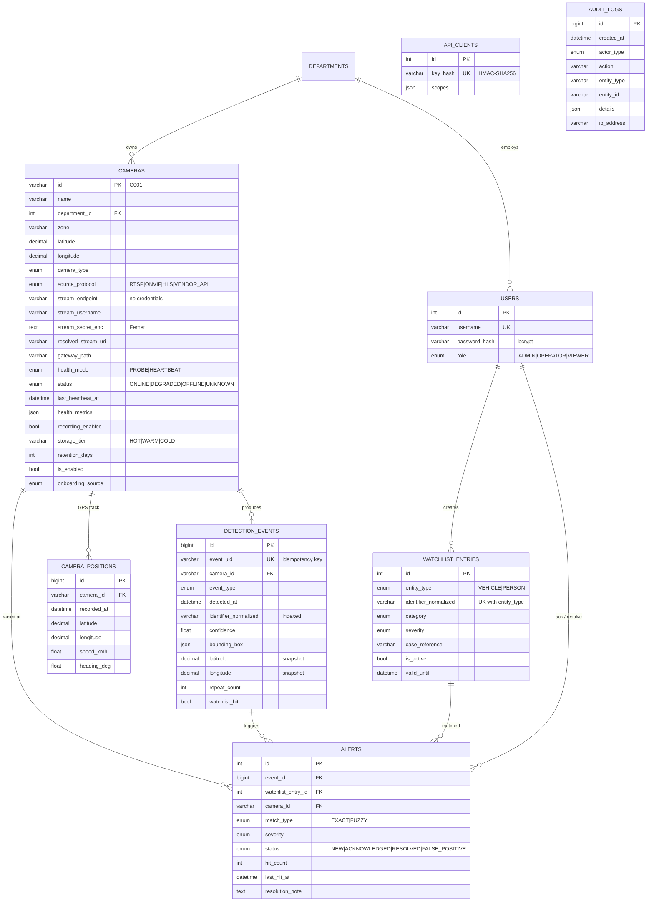

# Netra — Architecture

## 1. System overview

**Networks** (docker-compose mirrors production segmentation):

| Network | Members | Purpose |
|---|---|---|
| `cameras` | gateway, backend (probes), camera simulators | Camera VLAN analogue. Never reachable from browsers. |
| `app` | Caddy, backend, gateway | Application tier. |
| `data` | backend, MySQL, Redis, simulator (stream producer) | Data tier. No published ports. |

Only Caddy (HTTPS 8443) and the gateway's WebRTC UDP port are published; the API port is bound to `127.0.0.1` for local debugging.

## 2. Components

| Component | Responsibility | Code |
|---|---|---|
| Source adapters | One interface (`prepare`, `probe`, `playback`, `teardown`) hides RTSP / ONVIF / HLS / vendor-API differences. Adding a vendor SDK = one class. | `backend/app/adapters/` |
| Video gateway | Pulls RTSP on the camera network, remuxes to LL-HLS (≈1–2 s latency) and WebRTC/WHEP (sub-second), records fMP4 segments (6 h hot tier) and serves any time window as MP4 through its playback server. Paths registered dynamically through its control API; every viewer (live or recorded) authorised by the backend. | `infra/gateway/mediamtx.yml`, `backend/app/services/gateway.py` |
| Ingestion pipeline | Validates, deduplicates, persists and correlates analytics events; raises alerts; publishes real-time messages after commit. Shared by REST, batch and stream inputs. | `backend/app/services/ingestion.py` |
| Watchlist matcher | In-memory exact index + SymSpell-style deletion index for edit-distance-1 (OCR error) matches in O(len). Version counter in Redis keeps replicas coherent. | `backend/app/services/watchlist_matcher.py` |
| Stream consumer | Redis Streams consumer group (at-least-once, ACK after commit, dead-letter stream, reclaim of stale pending messages). | `backend/app/services/stream_consumer.py` |
| Event bus | Publish to one Redis Pub/Sub channel, every replica fans out to its own WebSockets → no sticky sessions required. | `backend/app/services/event_bus.py` |
| Health monitor | Probes each enabled camera (gateway path readiness + inbound bitrate, HLS manifest latency, vendor status API) or evaluates heartbeat age; hysteresis against flapping; one leader via Redis lock. | `backend/app/services/health_monitor.py` |
| Mobile cameras | Dashcams send GPS in heartbeats → `cameras.latitude/longitude/speed/heading` + `camera_positions` track; events carry their own capture position so alerts are geolocated on the move. | `backend/app/api/routes/cameras.py`, `simulator/sim/dashcam.py` |
| Console | React SPA: dashboard, map, live wall, registry, alerts, detections, trace, watchlist, audit, API clients. | `frontend/src/` |

## 3. Detection → alert sequence

### Duplicate & storm control (brief §9 "prevent duplicate or uncontrolled event generation")

| Layer | Mechanism | Effect |
|---|---|---|
| Transport retries | `event_id` unique constraint | A retried POST / re-delivered stream message never creates a second row |
| Sensor repeats | Redis `SET NX EX` per camera+type+identity (60 s) | 10 ANPR reads of one passing car → 1 event with `repeat_count = 9` |
| Alert storms | Open alert per watchlist-entry + camera within 5-min cool-down is updated (`hit_count`) instead of re-raised | Operators see one actionable alert, not dozens |
| Low-quality reads | `MIN_MATCH_CONFIDENCE` (0.60); fuzzy matches downgraded one severity level | Fewer false positives |
| Abuse | Per-API-key / per-user / per-IP rate limits in Redis | Bounded ingest from any single producer |

## 4. Live video path & stream security

* Credentials are stored **Fernet-encrypted** (`stream_secret_enc`) and the API refuses endpoints with inline `user:pass@`.
* Browsers only ever see the gateway path and a camera-scoped, short-lived token.
* Vendor-API snapshots go through `/cameras/{id}/snapshot?token=` so the vendor key stays server-side.
* `/api/v1/internal/*` and `/api/metrics` are blocked at the edge proxy.

## 5. Data model (ER diagram)

### Indexes (all created by the Alembic migration)

| Table | Index | Serves |
|---|---|---|
| detection_events | `(identifier_normalized, detected_at)` | Entity search & movement trace |
| detection_events | `(camera_id, detected_at)` | Per-camera history |
| detection_events | `(event_type, detected_at)`, `(detected_at)` | Filtered history, time-series |
| detection_events | `UNIQUE(event_uid)` | Idempotency |
| alerts | `(status, triggered_at)` | Open-alert queue |
| alerts | `(watchlist_entry_id, camera_id, last_hit_at)` | Cool-down lookup on the hot path |
| cameras | `(status)`, `(department_id, zone)`, `(source_protocol)`, `(latitude, longitude)` | Registry filters, map |
| camera_positions | `(camera_id, recorded_at)` | Dashcam track queries |
| watchlist_entries | `UNIQUE(entity_type, identifier_normalized)` | No duplicate records |
| audit_logs | `(entity_type, entity_id, created_at)` | Per-camera audit history |

Timestamps are stored as UTC `DATETIME(6)`; the ORM always returns timezone-aware values.
The schema is portable to Amazon RDS / Aurora MySQL with no changes.

## 6. Security controls

| Requirement (brief §13) | Implementation |
|---|---|
| Authentication & RBAC | JWT (HS256, 8 h) for people; ADMIN / OPERATOR / VIEWER enforced per route. Hashed, scoped API keys for machines (`events:write`, `cameras:heartbeat`, `cameras:write`). |
| Input validation | Pydantic v2 schemas (coordinates, URL schemes per protocol, plate format, bbox, timezone-aware timestamps, payload size) + semantic checks (camera enabled, clock skew, event age). |
| Secure stream URLs & credentials | Fernet encryption at rest, never serialised, inline credentials rejected, gateway injects them server-side, camera-scoped 5-min stream tokens. |
| HTTPS/TLS | Caddy terminates TLS (internal CA locally, automatic ACME in production), HSTS and security headers. |
| Audit logs | Logins (success/failure with IP), onboarding, edits (field-level diffs, secrets masked), enable/disable, status changes, stream access, alert raise/ack/resolve, watchlist changes, API-key issue/revoke. |
| Rate limiting | Redis fixed-window: login per IP, API per user, ingest per API key. |
| No secrets in Git | `.env` git-ignored; `make env` generates random secrets; seed reads everything from env. |
| Environment config | `pydantic-settings`; every tunable documented in `.env.example`. |
| Other | bcrypt (cost 12) with timing equaliser; account lockout; server-side token revocation; SSRF guard on every outbound camera request; strict CSP; least-privilege containers; internal endpoints blocked at the edge; generic 500 responses. Full list: [SECURITY.md](SECURITY.md). |
