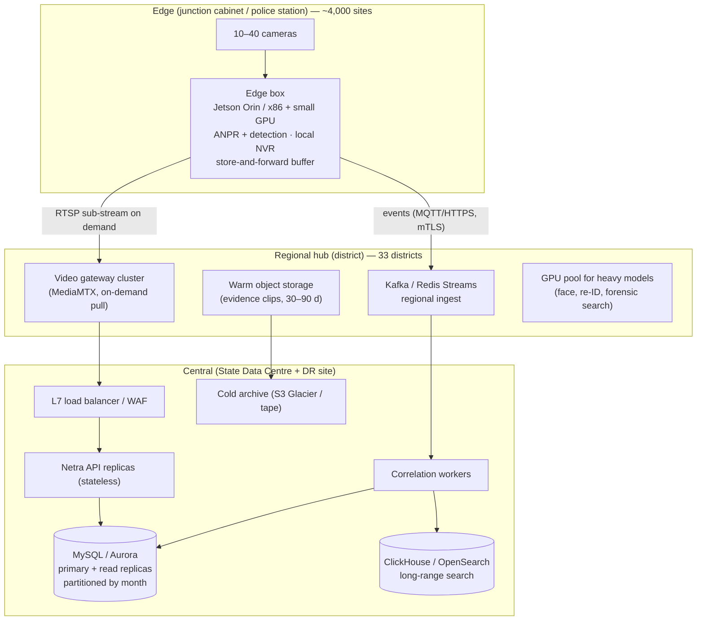

# Scalability & Deployment Note — from a 7-camera prototype to ~80,000

The prototype runs on one machine, but every component was chosen so that scaling is a matter of
**adding replicas and moving work to the edge**, not rewriting. This note explains how.

> All figures are planning estimates built from stated assumptions, not vendor quotes.

## 1. Guiding principle: move pixels as little as possible

80,000 cameras × 2 Mbps (1080p H.264) ≈ **160 Gbps** if every stream were sent to one data centre.
That is neither affordable nor necessary. Instead:

* **Video stays near the camera.** Recording and analytics run at the edge or in district hubs.
* **Metadata travels.** An ANPR event is ~0.6 KB. 4,000 events/s is only ~20 Mbps into the central tier.
* **Live video is pulled on demand.** The gateway only pulls a camera while someone is watching it
  (`STREAM_ON_DEMAND=true`), and prefers the sub-stream (≈ 256–512 kbps) for grids.

## 2. Tiered topology (central · regional · edge)

| Tier | Runs | Why |
|---|---|---|
| **Edge** | ANPR / vehicle / person detection on-device, local recording (7 days), event buffering during WAN loss, heartbeat agent | Removes >99 % of bandwidth; survives link outages (batch endpoint `/events/batch` replays buffered events idempotently) |
| **Regional (district)** | Video gateway cluster, regional message queue, warm storage for clips, heavier GPU models | Keeps live viewing and forensic search close to users; limits blast radius |
| **Central** | API, correlation, watchlist, alert routing, dashboards, long-term search, audit | One source of truth for watchlists and cross-district tracing |

The prototype already has the seams for this: adapters (edge/vendor integration), the batch API
(store-and-forward), Redis Streams consumer groups (drop-in replaceable by Kafka), heartbeat-mode
health (edge-reported), and on-demand gateway pulls.

## 3. Horizontal scaling & load balancing

| Component | How it scales | State |
|---|---|---|
| API (FastAPI) | N stateless replicas behind an L7 LB; any replica serves any WebSocket because fan-out goes through Redis Pub/Sub | Stateless |
| Ingestion | Consumer-group workers; partition Kafka topics by `camera_id` so per-camera ordering holds | Stateless |
| Health monitor | Leader-elected today; at scale shard cameras by `hash(camera_id) % N` per regional worker | Lease in Redis |
| Video gateway | One cluster per region; consistent-hash camera → gateway node; HLS cached by CDN/edge cache for many viewers of one stream | Per-stream |
| Watchlist matcher | In-memory index per worker (100k entries ≈ tens of MB); versioned invalidation | Cached |
| WebSocket | ~10–20k connections per replica; operators are in the low thousands | — |

Kubernetes (or ECS) with HPA on CPU + queue lag; PodDisruptionBudgets; readiness = `/api/ready`.

## 4. Throughput sizing

Assumptions: 30 % of cameras are ANPR-capable (24,000); average 10 unique vehicles/min/camera after
edge de-duplication; peak factor 3.

| Metric | Value |
|---|---|
| Average events | 24,000 × 10 / 60 ≈ **4,000 events/s** |
| Peak events | ≈ **12,000 events/s** |
| Rows/day | ≈ 345 M |
| Raw event storage | ≈ 345 M × 0.6 KB ≈ **200 GB/day** (≈ 70 GB compressed) |
| Central ingest bandwidth | ≈ 20 Mbps average |

The measured ingest path (validate → dedup → insert → match → commit) is a handful of indexed
statements; a single replica comfortably handles several hundred events/s, so **20–40 ingest
replicas** plus batched inserts cover the peak. Batching and moving the write path to Kafka →
bulk-insert workers takes MySQL to tens of thousands of rows/s.

## 5. Database indexing & scaling

* Already indexed for every query path (see ARCHITECTURE §5).
* **Partition `detection_events` by month** (`PARTITION BY RANGE (TO_DAYS(detected_at))`); drop or
  archive whole partitions instead of `DELETE`.
* **Aurora MySQL / RDS** primary + 2–3 read replicas; dashboards and search read from replicas.
* **Long-range search** (months of plates across the state) moves to ClickHouse or OpenSearch fed by
  the same event stream; MySQL keeps 30–90 days hot.
* Shard by region if a single writer becomes the limit (district ID is a natural shard key; the
  watchlist is replicated to every shard).
* Spatial queries: MySQL `POINT SRID 4326` + spatial index, or PostGIS, when geo-fencing is added.

## 6. Caching & message queues

| Use | Prototype | At scale |
|---|---|---|
| Real-time fan-out | Redis Pub/Sub | Redis Cluster Pub/Sub or NATS |
| Event ingest channel | Redis Streams (consumer group, DLQ, reclaim) | Kafka (partitioned by camera, 7-day retention, replay) |
| Dedup windows, rate limits, leader lease | Redis | Redis Cluster |
| Watchlist | In-process index + Redis version key | Same (pushed via Kafka compacted topic) |
| Dashboard stats | Direct SQL | Pre-aggregated per-minute rollups / materialised views, 5–10 s cache |

## 7. GPU / accelerator requirements

Rules of thumb for 1080p at a 5 fps analysis rate (YOLOv8n-class detector + lightweight OCR):

| Accelerator | Streams per device (ANPR) | Typical placement |
|---|---|---|
| Jetson Orin Nano 8 GB | 6–8 | Junction cabinet (edge) |
| Jetson Orin NX 16 GB | 12–16 | Police-station / multi-camera edge |
| NVIDIA T4 | 30–40 | District hub |
| NVIDIA L4 | 60–80 | District hub / central |

* 24,000 ANPR cameras ⇒ ~3,000 Orin Nano-class edge devices **or** ~600–800 T4-equivalents centrally.
  Edge is preferred because it also removes the bandwidth problem.
* Face recognition and cross-camera re-identification are heavier (≈ 10–15 streams per T4) and should
  run only on selected cameras / on demand in district GPU pools.
* NVIDIA DeepStream / TensorRT INT8 roughly doubles density.

## 8. Video bandwidth & low-bandwidth strategies

* Dual stream: main stream recorded locally, **sub-stream (CIF–720p, 256–512 kbps)** for live grids.
* **H.265** halves bitrate versus H.264 for recording.
* **On-demand pull**: the gateway connects only while a viewer is active; idle cameras use 0 WAN.
* **Event-triggered clips**: only a 10–20 s clip around an alert is uploaded centrally.
* **Snapshot mode** for 2G/4G sites (as with the vendor-API adapter): 1 fps JPEG ≈ 50–80 kbps.
* Adaptive bitrate LL-HLS for remote viewers; WebRTC for sub-second PTZ control.
* Concurrent central viewing budget: e.g. 2,000 simultaneous sub-streams × 0.5 Mbps ≈ 1 Gbps.

### Mobile cameras (dashcams, patrol vans)

Dashcams sit on cellular links, so they follow the same rule in its strongest form: ANPR and ADAS
run on the device, GPS + events are sent as small heartbeats (~200 bytes every 3 s ≈ 0.5 kbps), and
video is pulled only when an operator opens the feed or an alert needs evidence. The
`camera_positions` table is append-only time-series data: partition it by day with a short TTL,
or move it to a time-series store at fleet scale.

## 9. Hot / warm / cold storage

| Tier | Contents | Where | Retention |
|---|---|---|---|
| **Hot** | Continuous recording, recent events | Edge NVR / SSD; MySQL hot partitions | 7–15 days |
| **Warm** | Alert/evidence clips, event partitions, thumbnails | Regional object storage (MinIO / S3 Standard-IA) | 30–90 days |
| **Cold** | Legal-hold evidence, archived event partitions (Parquet) | S3 Glacier / tape at SDC | 1–7 years |

Continuous recording estimate: 80,000 × 1 Mbps (H.265, variable bitrate) ≈ 10 GB/s ≈ **860 TB/day**.
That is why recording belongs at the edge with only evidence promoted upward. Camera records carry
`storage_tier`, `storage_location` and `retention_days` so lifecycle policies can be driven from the
registry.

## 10. Monitoring, logging & health checks

* `/api/health` (liveness), `/api/ready` (DB + Redis), container healthchecks in Compose.
* Prometheus metrics at `/api/metrics`: `netra_events_total{type,result}`, `netra_alerts_total`,
  `netra_ingest_seconds` histogram, `netra_cameras{status}`, `netra_ws_connections`; the gateway exposes
  its own metrics. `docker compose --profile observability up` starts Prometheus.
* Structured JSON logs → Loki / ELK. Request IDs in every response.
* Camera health is itself a first-class monitored signal (status changes are audited and pushed live).
* SLO examples: detection-to-alert p95 < 2 s; camera status freshness < 30 s; ingest error rate < 0.1 %.

## 11. High availability & disaster recovery

| Layer | HA | DR |
|---|---|---|
| API / workers | ≥ 3 replicas across AZs / racks | Stateless; redeploy from images |
| MySQL | Multi-AZ primary + replicas, automated failover | Cross-site replica at DR data centre; PITR backups (RPO ≤ 5 min) |
| Redis | Sentinel / Cluster, AOF | Rebuildable (dedup windows and pub/sub are ephemeral; Streams re-driven from edge buffers) |
| Kafka | RF = 3 | MirrorMaker to DR |
| Gateways | N+1 per region | Cameras re-registered automatically (`reconcile_gateway` on startup) |
| Edge | Local buffering keeps working during WAN loss | Batch replay is idempotent |

Target RTO 30 min / RPO 5 min for the central tier; edge operation continues autonomously.

## 12. Cybersecurity & network segmentation

* **Segmented networks** (already modelled in Compose): camera VLAN ↔ gateway only; data tier has no
  ingress; only the TLS edge is internet/intranet facing.
* mTLS between edge boxes and the regional ingest; per-device API keys with minimal scopes and rotation.
* WAF + rate limiting at the edge; SSO (Keycloak / state IdP, OIDC) + MFA for operators.
* Secrets in Vault / AWS Secrets Manager; camera credentials encrypted (KMS-wrapped keys in prod).
* Immutable audit trail shipped to a WORM store; alert handling fully attributable.
* Hardening of camera firmware inventory (the registry records vendor/model/firmware for patch campaigns).
* Compliance with the DPDP Act 2023: purpose limitation, retention enforcement, access logs.

## 13. Estimated infrastructure & operating cost (order of magnitude)

Assumptions: hybrid model — existing cameras reused, edge compute added for ANPR cameras, central
software on a State Data Centre or GovCloud. Prices are indicative list prices (2026), INR at ₹85/USD.

| Item | Quantity | Unit (≈) | Capex / yr-equivalent |
|---|---|---|---|
| Edge AI boxes (Orin NX class, 12–16 streams) | 1,800 | ₹85k | ₹15.3 Cr capex |
| District hub servers (GPU L4 ×2, gateway, storage node) | 33 × 3 | ₹25 L | ₹24.8 Cr capex |
| Central compute (API, workers, DB, search) | ~60 nodes | ₹6 L/yr | ₹3.6 Cr/yr |
| Warm object storage (clips, 2 PB) | 2 PB | ₹1.5 Cr/PB/yr | ₹3.0 Cr/yr |
| Cold archive (5 PB) | 5 PB | ₹0.3 Cr/PB/yr | ₹1.5 Cr/yr |
| Network (district ↔ SDC, 1 Gbps × 33 + DR link) | — | — | ₹4–6 Cr/yr |
| Operations team (SRE, SOC, support) | 25–30 FTE | — | ₹6–8 Cr/yr |

Roughly **₹40 Cr one-time + ₹18–22 Cr/year** for a state-wide deployment of ~80,000 cameras
(≈ ₹2,500 per camera per year to run). The biggest levers are edge analytics (bandwidth), H.265 +
on-demand viewing (network) and evidence-only central storage (storage).

## 14. Deployment path

1. **Now (prototype)** — single host, Docker Compose, TLS via Caddy.
2. **Pilot (1 district, ~500 cameras)** — Kubernetes (k3s) cluster at the district hub, RDS/Aurora or
   managed MySQL, Redis Sentinel, 1 gateway pair, 20–40 edge boxes.
3. **Scale-out (state)** — Kafka backbone, ClickHouse search tier, regional gateway clusters,
   GitOps (Argo CD), multi-site DR, SSO integration.
